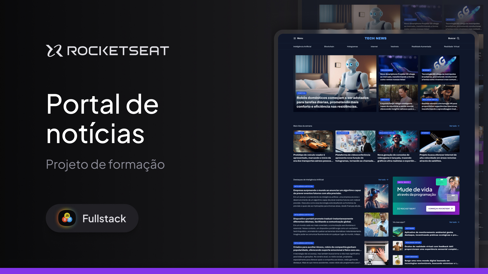

<h1 align="center">
  Portal de Notícias
</h1>

## Projeto

Este projeto é uma homepage de um portal de noticias sobre tecnlogia para ser um visualizado em um ambiente desktop, o projeto foi produzido durante a formação full-stack da Rocketseat

## Tecnologias

Esse projeto foi desenvolvido com as seguintes tecnologias

- HTML
- CSS

---

## Acessar o Projeto

Para acessar o projeto, basta clicar neste link abaixo:  
<a href="https://pduartesilva2005.github.io/portal-de-noticias/" target="_blank">Ver o projeto online!</a>

Criado por Pedro Duarte
